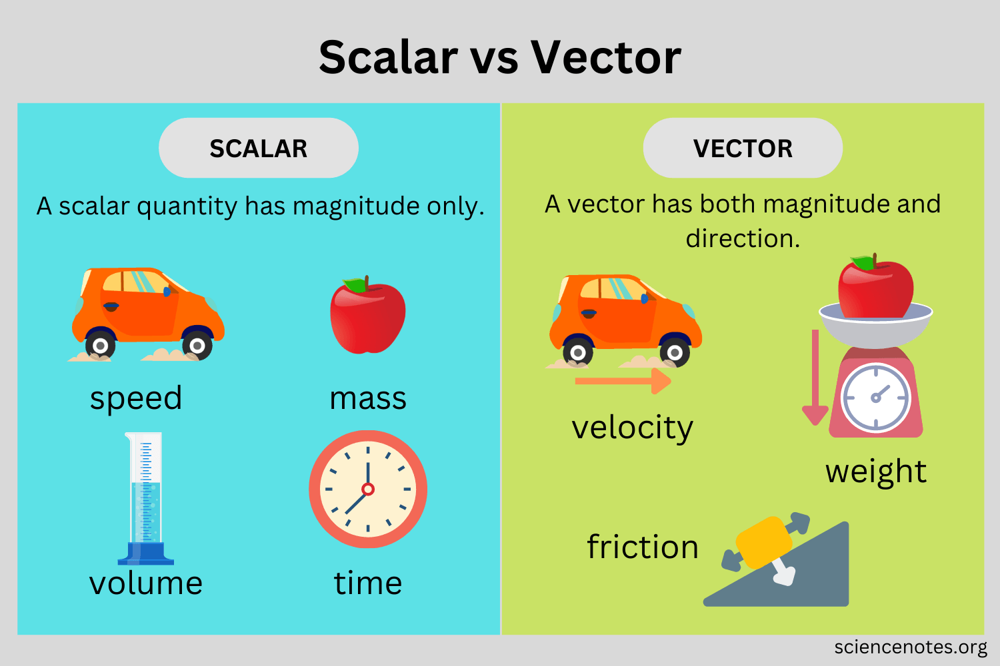

## Vector Fundamentals

A vector is a mathematical entity that possesses both magnitude and direction, making it distinct from scalars which only have magnitude. 
Originally developed in geometry and physics, vectors were created to represent quantities like forces, velocity, and displacement that require both size and directional components.

## Vector Space Definition

A vector space (also called a linear space) is a collection of objects called vectors that can undergo two fundamental operations:

**Vector Addition**

- Combines two vectors to produce a third vector within the same space
- Must follow commutative and associative properties

**Scalar Multiplication**

- Involves multiplying vectors by numbers (scalars)
- Results in scaling the vector while maintaining its direction

## Mathematical Properties

**Vector Space Axioms**
The space must satisfy specific requirements for both addition and scalar multiplication:

- Closure under addition: When two vectors are added, the result remains in the vector space
- Commutativity: The order of addition doesn't matter
- Associativity: Grouping of additions doesn't affect the result
- Distributivity: Scalar multiplication distributes over vector addition

## Types of Vectors

**Special Categories**[6]:

- Zero vectors: Vectors with magnitude of zero, represented as $$\overrightarrow{0}$$ = (0,0,0)
- Unit vectors: Vectors with magnitude of one, denoted as $$\hat{a}$$

## Dimensionality

Vector spaces are characterized by their dimension, which indicates the number of independent directions in the space. They can be:

- Finite-dimensional: Having a natural number as dimension
- Infinite-dimensional: Having an infinite cardinal as dimension

## Applications

Vector spaces serve as fundamental structures in:

- Linear algebra and matrix operations
- Physical quantity representation
- Geometric modeling
- Mathematical analysis and computation

The concept provides a unified framework for handling various mathematical and physical quantities while maintaining consistent operational rules and properties[1].

# References:
[1] https://en.wikipedia.org/wiki/Vector_(mathematics)
[2] https://byjus.com/maths/vector-space/
[3] https://www.youtube.com/watch?v=0hWHZ9T7SHc
[4] https://sidecarglobal.com/blog/demystifying-vectors-and-embeddings-in-ai-a-beginners-guide
[5] https://www.pinecone.io/learn/vector-embeddings/
[6] https://www.cuemath.com/geometry/vectors/
[7] https://en.wikipedia.org/wiki/Vector_space
[8] https://www.singlestore.com/blog/beginner-guide-to-vector-embeddings/
[9] https://www.techtarget.com/searchenterpriseai/definition/vector-embeddings
[10] https://cloud.google.com/blog/topics/developers-practitioners/meet-ais-multitool-vector-embeddings
