- [cheatsheet1](https://github.com/JakeSteam/Mermaid)
- [cheatsheet1](https://mermaid.js.org/syntax/flowchart.html)

- colors for box
  - `style B fill:#4c4c4c,stroke:#fff`: grey background, white text
  - mermaid only recognizes hex colors

- declare type and orientation in first line

  - types
    - `flowchart`: for processes, workflows
    - `sequenceDiagram`: interactions between objects in a system over time
    - `classDiagram`: structure of classes and their relationships in object-oriented programming
    - `stateDiagram`: how different inputs affect the behavior of a system
    - `gantt` Gannt Charts: project management, showing tasks over time and their dependencies
    - `erDiagram` Entity-Relationship Diagram: Model the relationships between entities in a database
    - C4 Diagrams (`C4CsysContext`, `C4Container`, `C4Component`, `C4Class`): software architecture, providing a structured way to describe the architecture of software systems
    - `pie` Pie Chart: display proportional data
    - `gitGraph`: Visualize Git branching flows
  - orientation
    - `TD`, `TB`: Top to Down/Bottom, `BT`: bottom to top, `LR`: left to right, `RL`: right to left

- declare colors

```mermaid
flowchart TD
  A --> B

  style B fill:#4c4c4c,stroke:#fff
```

